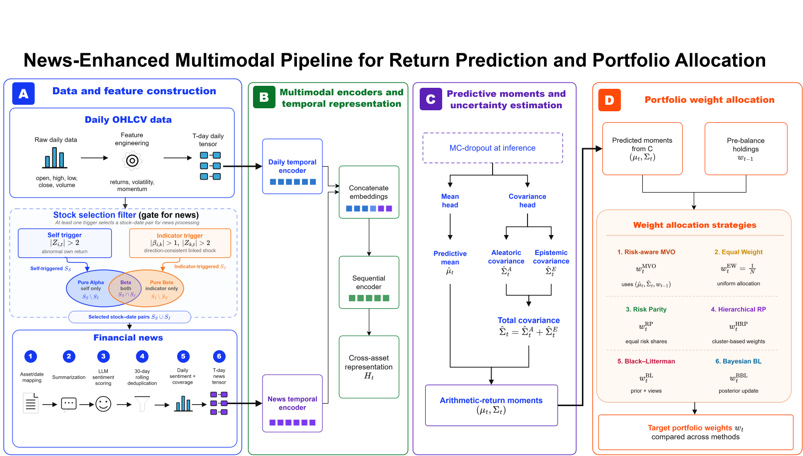

# Tyche: LLM-Driven Small-Capitalization Investment Research

Tyche is an LLM-driven quantitative investment research platform for discovering
and evaluating small-capitalization (small-cap) equities. It combines financial
news understanding, market data, uncertainty-aware return forecasting, and
portfolio construction in one reproducible research pipeline.

> **Research software, not financial advice.** Backtests are historical
> simulations and do not guarantee future performance. Always validate results
> independently before making investment decisions.

## Why Tyche?

Small-cap companies can offer meaningful growth opportunities, but they are also
more sensitive to liquidity, volatility, sparse information, and changing market
conditions. Tyche helps researchers study those challenges by:

- using LLM-powered agents to summarize financial news and score ticker-level
  sentiment;
- combining news sentiment with daily OHLCV market features;
- estimating both expected returns and predictive uncertainty;
- testing multiple portfolio allocation methods with realistic costs and
  slippage; and
- making data, configuration, and experiments reproducible with DVC.

<div style="background:white; padding:12px;">
  
</div>

1. **News-sentiment extraction** — an agentic pipeline (LangGraph + Azure OpenAI)
   ingests raw news, summarizes each article, scores financial sentiment, and
   neutralizes systematic bias to produce a clean per-(article, ticker) sentiment
   contract.
2. **Portfolio construction** — a multimodal deep-learning model fuses daily
   OHLCV and news-sentiment features into a predicted
   uncertainty-aware return distribution (mean plus aleatoric and epistemic covariance)
   per rebalance date. Gaussian and Student-$t$ models train solely with their
   distributional negative log-likelihood; MC dropout estimates model uncertainty at
   inference. Those forecasts
   drive six allocation strategies (EW, BL, Bayesian BL, MVO, RP, HRP), which are
   backtested with transaction costs and slippage across holding periods and cost
   scenarios.

## Project workflow

```text
Financial news + market data
           |
           v
LLM summaries and ticker-level sentiment
           |
           v
Feature engineering and small-cap universe filters
           |
           v
Uncertainty-aware return forecasts
           |
           v
Portfolio construction and backtesting
```

## Core capabilities

### LLM-powered news intelligence

The news pipeline uses LangGraph and Azure OpenAI to summarize articles, score
financial sentiment, and produce a structured sentiment contract for each
article-ticker pair. Alternative local or hosted LLM serving configurations are
available for experimentation.

### Small-cap quantitative research

Tyche combines sentiment with OHLCV features and supports configurable universe
selection, feature windows, train/validation/test splits, and alpha filters.
The resulting forecasts are designed for comparative research across rebalance
dates rather than one-off predictions.

### Uncertainty-aware forecasting

The multimodal model predicts a return distribution with aleatoric and epistemic
uncertainty. Gaussian and Student-$t$ objectives are supported, while Monte Carlo
dropout estimates model uncertainty during inference.

### Portfolio construction and evaluation

Forecasts can drive equal-weight, Black-Litterman, Bayesian Black-Litterman,
mean-variance, risk-parity, and hierarchical risk-parity allocations. Backtests
include configurable holding periods, transaction costs, and slippage.

## Quick start

1. Install [`uv`](https://docs.astral.sh/uv/) and Python 3.10.
2. Install dependencies:
   ```bash
   uv sync
   ```
   Add a hardware extra when training the model, for example
   `uv sync --extra cpu`, `uv sync --extra mps`, or a CUDA extra.
3. Copy `.env.example` to `.env` and configure the required values, including
   the Azure OpenAI key used by the news scorer.
4. Pull tracked data and benchmark artifacts:
   ```bash
   uv run dvc pull
   ```

Full walkthrough: [`docs/setup.md`](docs/setup.md).

## Running the pipeline

The installed command-line entry point is:

```bash
uv run tyche --help
```

Individual research stages and experiments are documented in the
[documentation index](#documentation). Configuration is managed through the
project configuration files and environment variables described in
[`docs/configuration.md`](docs/configuration.md).

## Documentation

| Section | Description |
| --- | --- |
| [Setup](docs/setup.md) | Environment, dependencies, `.env`, DVC-tracked data |
| [News Sentiment Pipeline](docs/news-pipeline.md) | The agent DAG that turns raw news into a sentiment contract |
| [LLM Serving](docs/setup.md#4-serve-the-sentiment-models-you-want-to-test) | Local vLLM compose files for Mistral-7B-Instruct and Llama-2-13B-chat |
| [Data & Features](docs/data-features.md) | Universe, calendar, feature branches, windowing/splits |
| [Pure-Alpha Filter](docs/pure-alpha-filter.md) | The I-MACD indicator and the BUY/SELL/HOLD stock filter built on it |
| [Alpha-Beta Filter](docs/macro-alpha-filter.md) | The macro-beta trigger strategy, as a second interchangeable stock filter |
| [Predictive Model](docs/model.md) | The multimodal return-distribution network, training, and inference |
| [Portfolio Management](docs/portfolio-management.md) | Allocation strategies, transaction costs, and the backtest engine |
| [Configuration Reference](docs/configuration.md) | Every config surface, grouped by domain |

## License

MIT — see [`LICENSE`](LICENSE).
