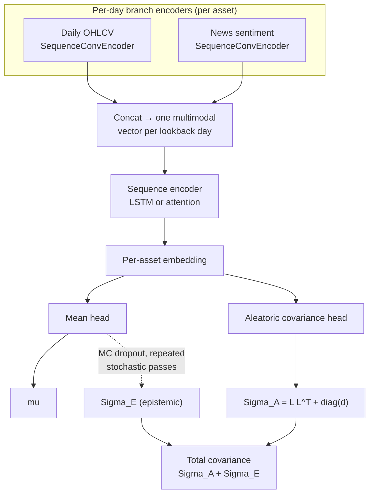

# Predictive Model

A multimodal deep-learning model that predicts the distribution of forward
`H`-day cross-asset log returns — a mean vector and a full covariance matrix —
from the two aligned feature branches described in
[Data & Features](data-features.md).

## Architecture (`tyche/portfolio/model/network.py`)

Per asset, two branch encoders (`tyche/portfolio/model/encoders.py`) each
produce a per-day embedding sequence:

- `SequenceConvEncoder` — one-to-two Conv1D + GELU + norm + dropout layers,
  turning a `[.., T, F]` daily feature sequence into `[.., T, C]` per-day
  embeddings. Both branches use it.

The per-day embeddings across branches are concatenated into one multimodal
vector per lookback day and run through a one-layer LSTM (or a light
self-attention encoder, selected by `ModelConfig.sequence_encoder`). The
`use_news` flag can drop the news branch entirely for ablations
without touching any other wiring.

The final asset embeddings feed two heads:

- a **mean head** predicting `mu ∈ R^N`
- an **aleatoric-covariance head** predicting a valid
  `Sigma_A = L L^T + diag(d)` via a low-rank-plus-diagonal parameterization
  (rank controlled by `ModelConfig.cov_rank`)

At inference, repeated stochastic forward passes (MC dropout,
`TrainConfig.mc_dropout_samples`) turn disagreement across the mean head's
outputs into an **epistemic** covariance `Sigma_E`; the total predictive
covariance is `Sigma_A + Sigma_E`.

## Training objective (`tyche/portfolio/model/losses.py`)

A distributional negative log-likelihood — multivariate Gaussian or
multivariate Student-t, selected by `TrainConfig.target_distribution` — computed
through the predicted Cholesky factor directly (a triangular solve for the
quadratic form, `log|Sigma_A| = 2 Σ log diag(L)`), never an explicit matrix
inverse or determinant. This NLL is the complete training objective; no auxiliary
penalty terms are applied.

## Training procedure (`tyche/portfolio/model/train.py`)

Training optimizes the return-distribution likelihood only — no portfolio
objective enters here. The checkpoint with the lowest validation NLL is kept.
Each epoch logs NLL plus two diagnostics of what the
allocator actually consumes:

- **mean dispersion** — the model can post a falling NLL while `mu` collapses
  to the same value across every asset, which carries zero allocation signal;
  cross-sectional IC/rank-IC surfaces that failure even though the loss
  doesn't.
- **aleatoric-covariance health** — mean predicted variance, mean
  off-diagonal correlation, and the variance spread, to catch the covariance
  head drifting toward a degenerate solution (which shows up downstream as an
  unstable `Sigma^-1 mu` in direct Black-Litterman).

## Inference (`tyche/portfolio/model/predict.py`)

For every out-of-sample decision day, the trained model emits the MC-dropout
predictive mean, aleatoric covariance, epistemic covariance, and their sum.
Only the total moments cross the boundary into portfolio construction —
predictions are persisted to `.npz` so allocation/backtest tuning never has to
re-run the network.

## Running training + inference

Training and prediction are invoked together through the portfolio runner,
not as standalone commands — see
[Portfolio Management](portfolio-management.md#running-it) for the CLI.
Model hyperparameters (`ModelConfig`) and training hyperparameters
(`TrainConfig`) live in `tyche/portfolio/config.py`; see
[Configuration Reference](configuration.md).
