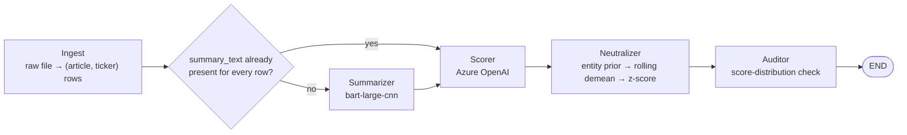

# News Sentiment Pipeline

An agentic pipeline, wired as a LangGraph `StateGraph`, that turns a raw news
feed into a clean, bias-neutralized financial-sentiment contract — one row per
`(article, ticker)`.



The summarizer node is conditional: if every ingested row already carries a
pre-computed `summary_text` (some sources ship one), the node — and its model
load — is skipped and ingestion flows straight to the scorer.

## Agents

1. **Ingest** — reads the source file with Dask (lazy, partitioned) so a
   multi-GB feed is never fully materialized just to read it, then computes to
   pandas for the row-level explode. Parses publication time, stamps
   processing time, explodes the multi-ticker `symbols` column into one row
   per `(article, ticker)`, and assigns a stable `group_key` and a per-article
   `article_id`.
2. **Summarizer** — compresses each article's full text to a short abstractive
   summary with a locally-loaded `facebook/bart-large-cnn`, one summary per
   row, so the scorer works from a single summary rather than sentence spans.
   Articles longer than BART's 1024-token input cap are handled by map-reduce
   summarization (chunk, summarize each chunk, summarize the concatenation).
3. **Scorer** — the only agent that calls the sentiment model. Sentiment is
   extracted via an Azure OpenAI chat model reached through LangChain, given a
   financial-sentiment system prompt and asked to return calibrated
   positive/negative/neutral probabilities. Output is validated against a
   pydantic schema and retried on transient failures with exponential backoff.
   Calls are cached by exact summary text.
4. **Neutralizer** — removes systematic bias in three strict, causal steps:
   entity-prior correction (subtracting a measured named-vs-masked offset per
   ticker), a strictly trailing winsorized rolling demean per ticker (with
   shrinkage toward the group for sparse names), and a group × day
   cross-sectional z-score to strip common-mode narrative.
5. **Auditor** — verifies the pipeline is honest, in four modes:
   - **A** (label order + sanity sentences) — runs at the start of every full
     pipeline execution and halts before scoring if the model looks wrong.
   - **B** (entity-bias measurement) — produces the entity-prior artifact the
     neutralizer consumes; run offline/periodically, not per-pipeline-run.
   - **C** (causality verification) — confirms future rows never change past
     scores.
   - **D** (score-distribution health check) — runs at the end of every
     pipeline execution.

## Running it

```bash
# Full pipeline, unbounded
uv run tyche run --input data/zanista/news.parquet --output data/output/news_sentiment.parquet

# Bounded dev/smoke run (skips the LangGraph DAG, pushes the slice through the
# same agents directly)
uv run tyche run --input data/zanista/news.parquet --limit 50

# Individual audits
uv run tyche audit-a
uv run tyche audit-b --input data/zanista/news.parquet --limit 5000
uv run tyche audit-c --input data/zanista/news.parquet --limit 200
```

`--limit` bounds the number of *source articles* read (not output rows — one
article explodes into one row per ticker it mentions).

The pipeline is also runnable as the installed console script: `uv run tyche
run ...` (declared under `[project.scripts]` in `pyproject.toml`, pointing at
`tyche.news.sentiment_pipeline:main`).

## Configuration

All tunables (paths, ingest grouping, summarizer/embedder device and batch
size, deduplication thresholds, sentiment-scorer endpoint/deployment/retries,
neutralizer windows, auditor thresholds, Dask block size) are environment-
variable-backed dataclasses in `tyche/news/config.py`. See
[Configuration Reference](configuration.md) for the full list.
